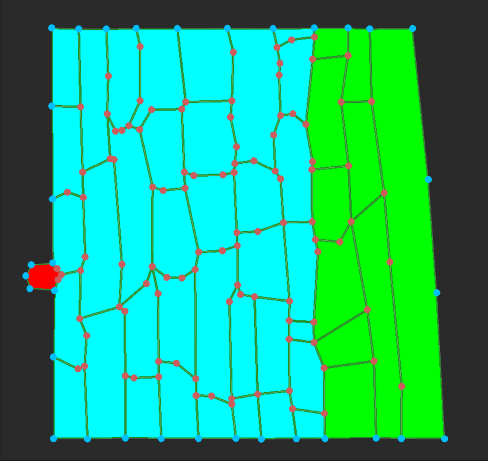
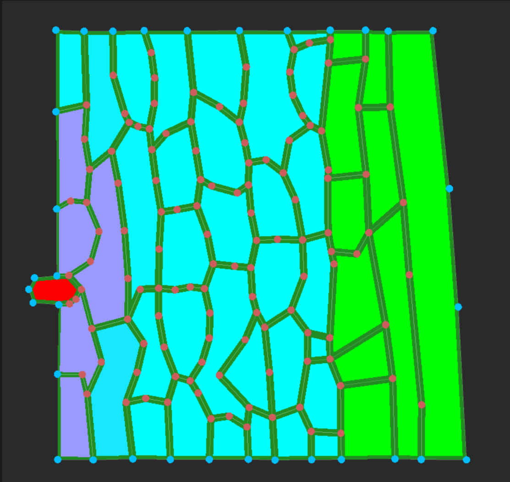
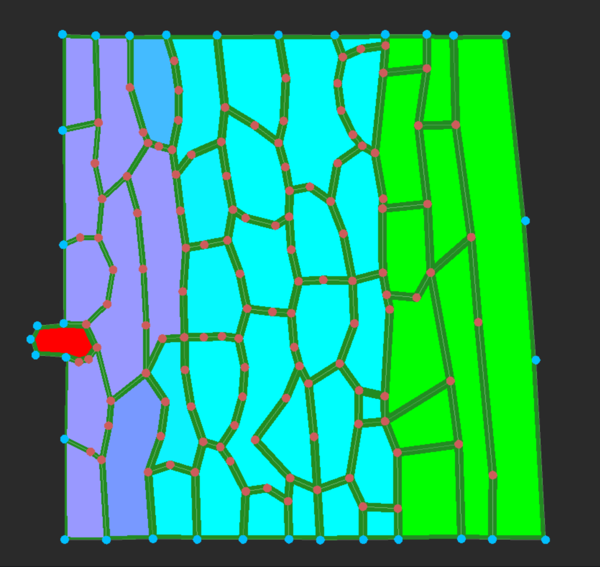
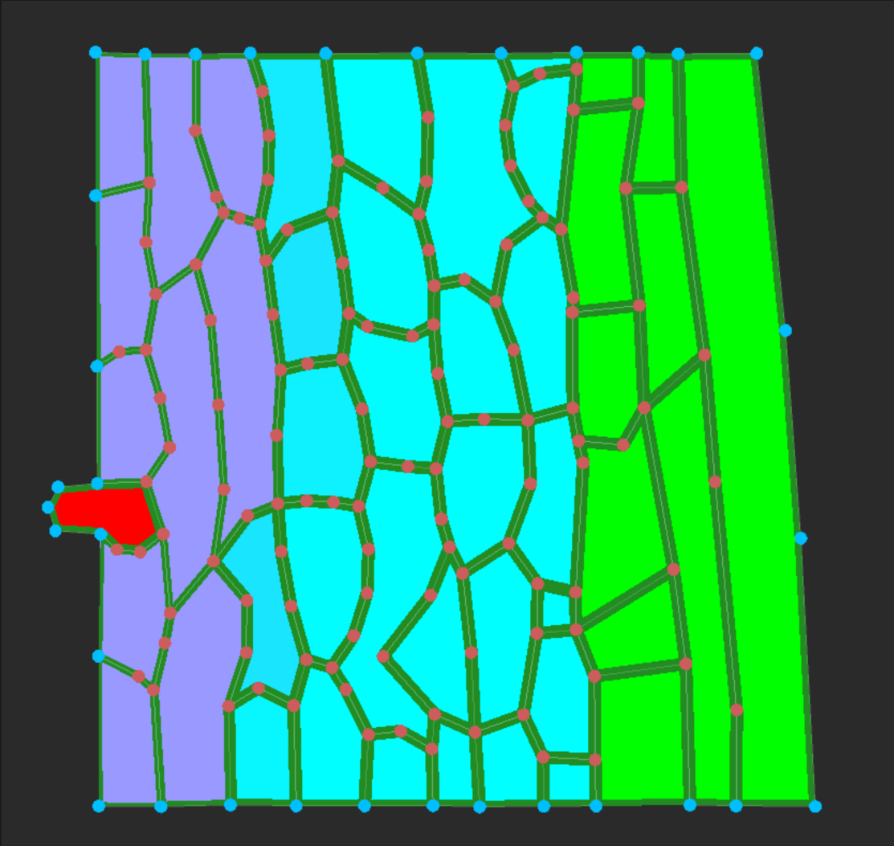
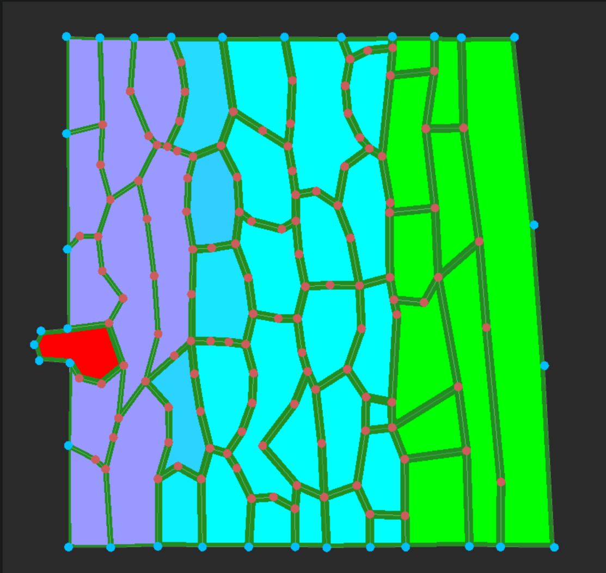
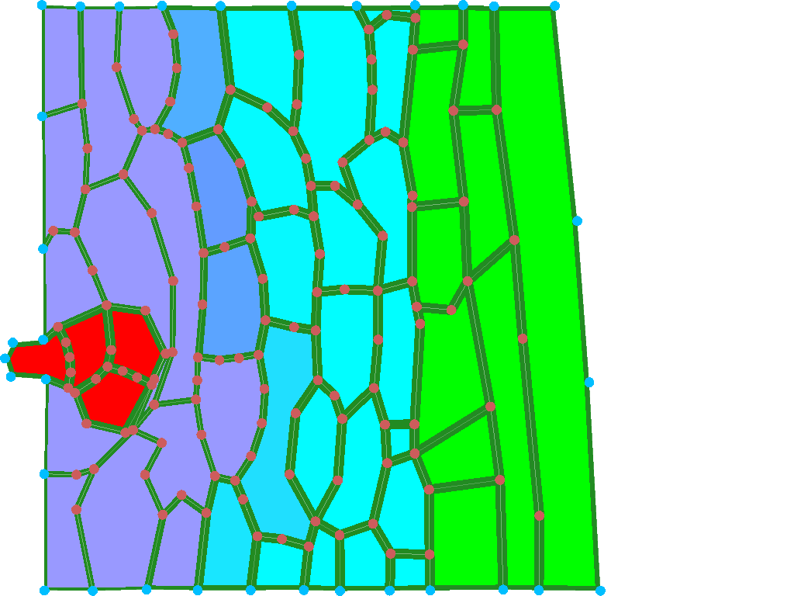
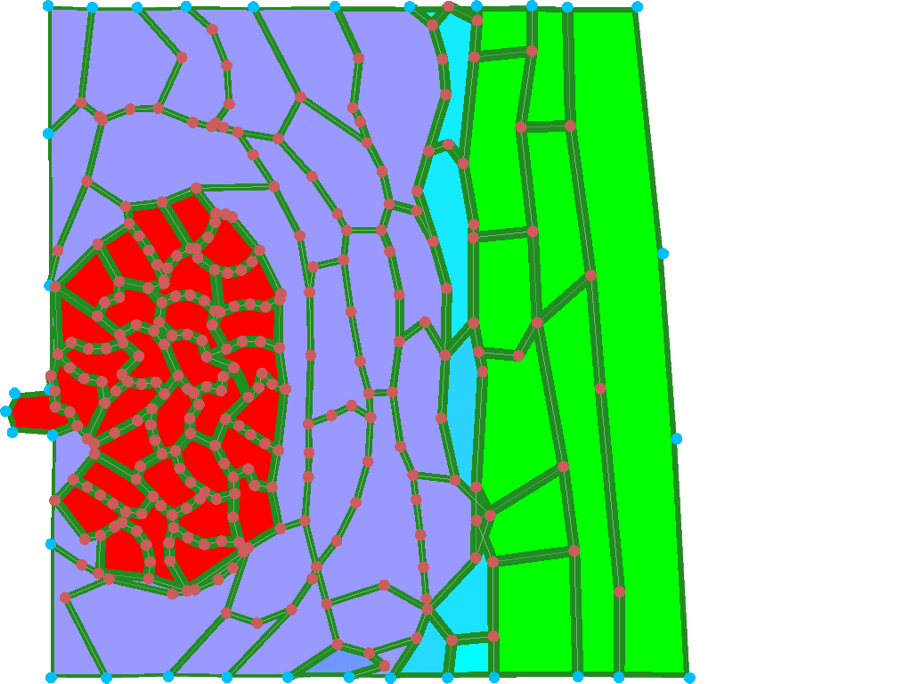
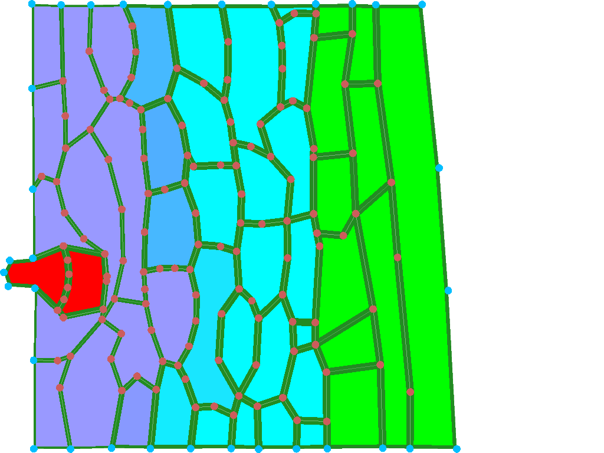
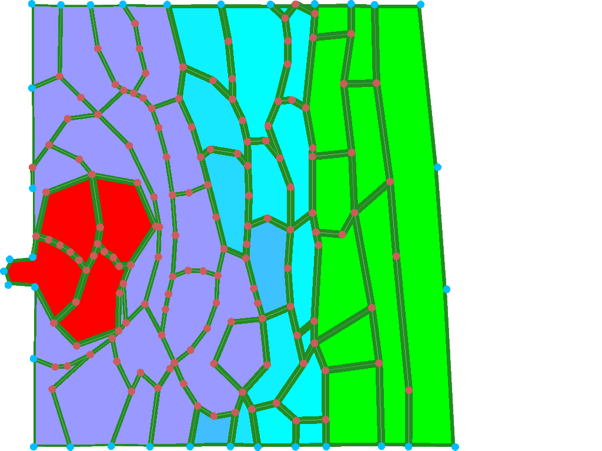

## Assignment 5

##### Task 1:

 - initial state  - 30 minutes run  - 60 minutes run - 90 minutes run  - 120 minutes run

The infected tissue spreads starting from cells that were the closest to the interveining pathogen. Pathogen itself grows slower than the infection overall. Deformation primarily happens due to the pressure of the infection on the surrounding healthy tissue. As pathogen grows, it exerts pressure on the surrounding healthy tissue, causing it to deform and potentially leading to tissue damage. The relaxation of the tissue also contributes to the change in the initial shape.

#### Task 2:
```
double patho_chem_level = c->Chemical(0) / (0.5);
    if (patho_chem_level > 1.2) {
        patho_chem_level = 1.2;
    }
    double stiffness_inf = 3;
    if(patho_chem_level>0.1 && c->CellType()!=2){
        c->SetCellVeto(false);
        stiffness_inf = 3 - (patho_chem_level);
    c->LoopWallElements([stiffness_inf](auto wallElementInfo){
        wallElementInfo->getWallElement()->setStiffness(stiffness_inf);
    });
    }
    else{
        c->LoopWallElements([stiffness_inf](auto wallElementInfo){
        wallElementInfo->getWallElement()->setStiffness(stiffness_inf);
        });
        c->SetCellVeto(true);
    }
   ```
The function above describes the mechanism of cells' wall. The mechanism is dependent on the pathogen chemistry level. Once it goes over 0.1 (and cell type does not equal 2). Stiffness level of a cell drops from 3 based on the chemistry level of the pathogen. Pathogen itself is not affected by the function. In case pathogen chemistry level drops, the stiffness level can return to normal.

#### Task 3:

```
void Infection::CelltoCellTransport(Wall *w, double *dchem_c1, double *dchem_c2) {
	// add biochemical transport rules here
    double sum =  w->C1()->Area() + w->C2()->Area();
    double corr1 = w->C2()->Area() / sum;
    double corr2 = w->C1()->Area() / sum;

    double length = 1.0;
    double stiffness = 1.0;
    getLengthAndStiffness(w,&length,&stiffness);
    double diffusionCoef;
    if(stiffness>0.001){
        diffusionCoef = 0.00001/stiffness;
    }
    else{diffusionCoef=0.00001;}

    double phi = length * diffusionCoef * ( w->C2()->Chemical(0) - w->C1()->Chemical(0) );

    dchem_c1[0] += corr1 * phi;
    dchem_c2[0] -= corr2 * phi;
 ```
    
In the above code, diffusion coefficient is defined once the stiffness of a cell is at least larger than 0.001. It is then a equal to the division 0.00001 by the stiffness of a cell. If the stiffness is less than 0.001, the diffusion coefficient is set to 0.00001.

This creates a feedback loop:

```
more chemical in a cell
        |
        v
lower wall stiffness   (stiffness = 3 - chemical level)
        |
        v
higher diffusion       (diffusion = 0.00001 / stiffness)
        |
        v
chemical spreads faster to the neighbour cells
        |
        v
more chemical in the neighbours  --> (back to the top)
```

This is a positive feedback loop. More chemical makes the walls softer, softer walls let the chemical spread faster, and that brings even more chemical into the next cells, so the infection speeds itself up.

#### Task 4:

We ran the model twice with a different `rel_cell_div_threshold` (default is 2): once lower (1.5) and once higher (3). In 2 hours the pathogen divides only once at most, so we ran both for 8 hours to see the difference better.

Threshold 1.5:  - 4 hours  - 8 hours

Threshold 3:  - 4 hours  - 8 hours

Number of pathogen cells:

| Time | Threshold 1.5 | Threshold 3 |
|------|---------------|-------------|
| 2 h  | 2  | 1 |
| 4 h  | 4  | 2 |
| 6 h  | 8  | 2 |
| 8 h  | 32 | 4 |

A pathogen cell keeps growing and divides when its area gets bigger than `rel_cell_div_threshold` times its base area. With a lower threshold the cells divide sooner, so there are more pathogen cells, and because every cell keeps growing, the pathogen also takes up more space (after 8 hours about twice the area of the threshold 3 run). With a higher threshold the cells divide later, so you get a few big cells and the pathogen population expands slower.

#### Task 5:

In this model the cells have a real shape in 2D space, and two cells are neighbours only if they share a wall. The chemical can only move between neighbours through that shared wall, and how fast it moves depends on the wall (its length and stiffness) and on the size of the two cells. The neighbours can also change during the simulation, because the pathogen cells grow and divide and the tissue deforms, so new walls appear and old ones change.

In the other models we worked with there were no neighbours like this. In the SIR/SIRD model there is no space, so everyone can meet everyone. In the metabolic model there are no cells at all, only reactions. In the Boolean network and in the neural networks the connections are fixed and never change during the simulation.

### Task 6:
The defense would go into `CellHouseKeeping`, in the "cell wall weakening" part. Right now the code there checks `patho_chem_level > 0.1` and lowers the stiffness. The defense is just one check: if the chemical is above some higher threshold, the cell does the opposite and makes its walls stiffer instead of softer.
```CellHouseKeeping(c):
if c is pathogen:
    enlarge target area
    divide if area > rel_cell_div_threshold * base area

level = c.Chemical(0) / 0.5
if level > 1.2: level = 1.2

// new defence condition
if c is not pathogen and level > defense_threshold:
    stiffness = 3 + k * level    
    set stiffness for all wall elements of c
    c.SetCellVeto(true)              // walls are not allowed to reconfigure

// weakining runs now only when defence is off
else if c is not pathogen and level > 0.1:
    stiffness = 3 - level
    set stiffness for all wall elements of c
    c.SetCellVeto(false)

else:
    stiffness = 3
    set stiffness for all wall elements of c
    c.SetCellVeto(true)
```
`defense_threshold` has to be bigger than 0.1, otherwise the weakening is never used. We would start with something like >0.5.

This adds a negative feedback. In Task 3 the diffusion coefficient is `0.00001 / stiffness`, so when cell makes its walls stiffer the chemical moves slower through them. That leads to logical sequence: More chemical the stiffer wall so slower diffusion so less chemical reaches the neighbours. So it works against the positive loop and slows the infection down.

Little thing to notice that the defense only starts above the threshold, so below it the positive loop is still working normally. Cells with low chemical level still soften and still let the infection going through. So threshold is basically decides how far the infection gets before the tissue stops it.
